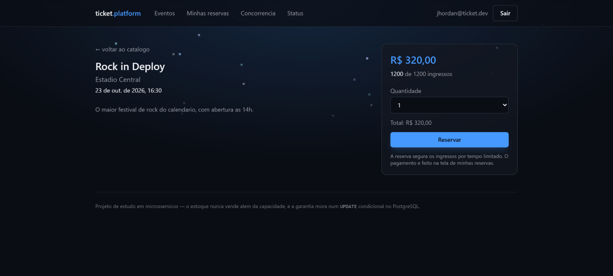
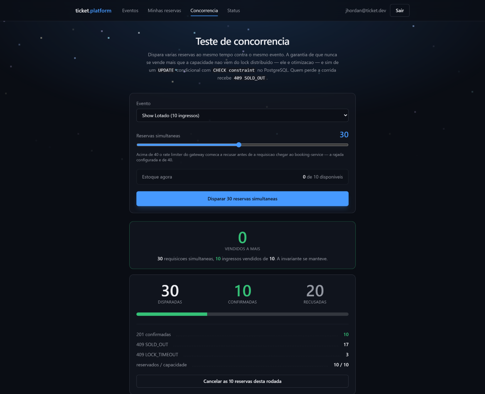
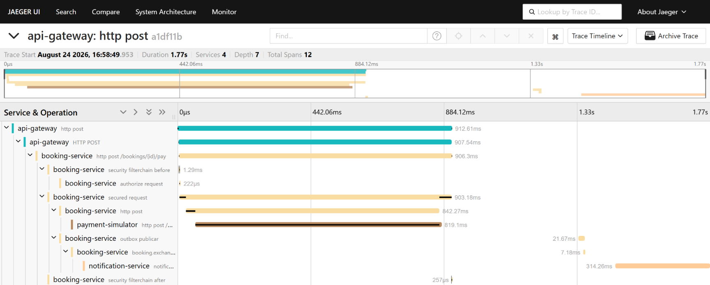
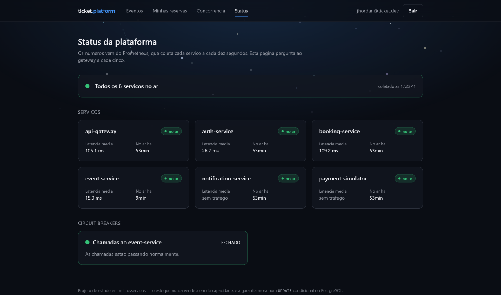
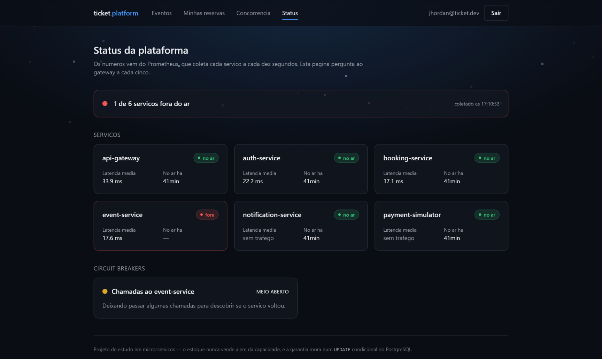
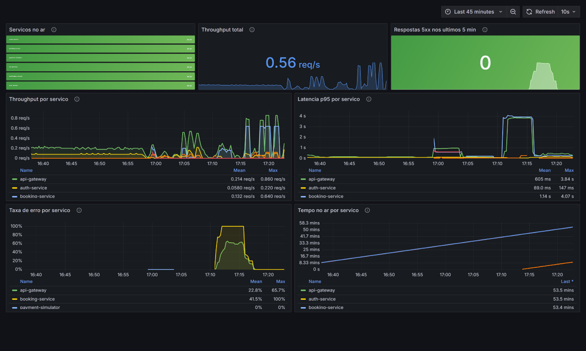
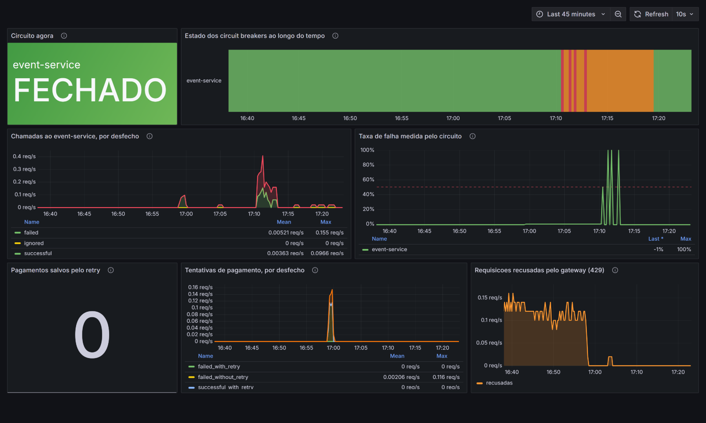
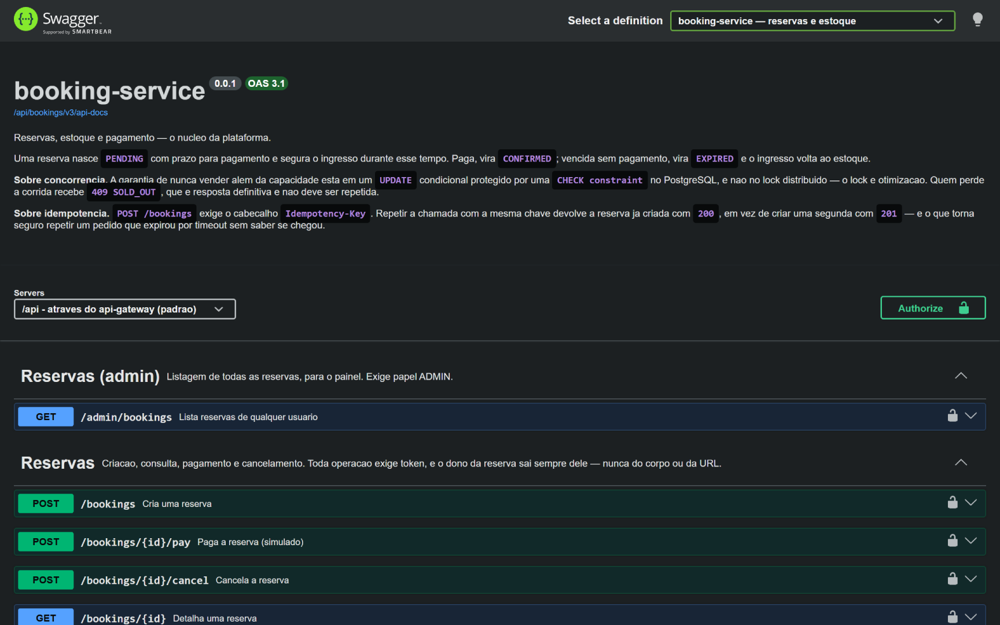
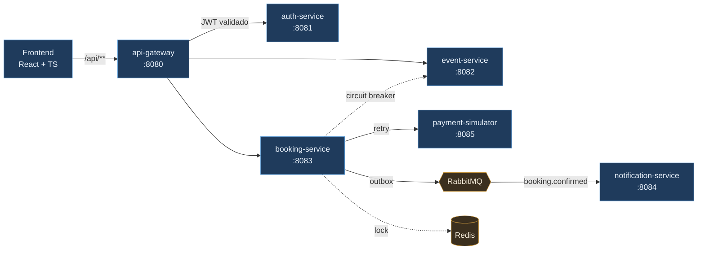

<div align="center">

# ticket.platform

**Venda de ingressos em microsserviços — e o problema de não vender o mesmo assento duas vezes.**

<sub>Projeto de portfólio — estudo aprofundado de um problema real de concorrência.</sub>

[](#)
[](#)
[](#)
[](#)
[](#)
[](#)

[](#rodando)
[](k8s/)
[](#observabilidade)
[](#observabilidade)
[](#observabilidade)
[](#testes)

</div>

---

## Sobre este projeto

É um projeto de **portfólio**, e o caminho até ele foi de estudo — catorze fases, uma por Pull
Request, cada uma partindo de um documento de decisões escrito antes do código. Não roda em
produção e não finge que roda: as [limitações estão listadas](#limitações-conscientes), cada uma
com o motivo.

O que ele **não** é: um CRUD com um tema por cima. A diferença está no tipo de erro possível. Num
cadastro, o pior caso é uma tela feia; aqui existe uma **invariante que pode ser violada**, e
violá-la custa dinheiro.

Escolhi esse problema justamente porque ele **não aparece em desenvolvimento**. A implementação
ingênua passa em todo teste manual, com um usuário de cada vez, e quebra exatamente quando o
sistema fica interessante. Estudá-lo obriga a sair do framework e entender o que o banco de dados
garante de verdade — que era o que eu queria aprender. E é um problema comum: qualquer sistema que
venda estoque finito sob pico de demanda o enfrenta. Ingressos, passagens, vagas de curso, black
friday.

O projeto foi construído em volta de três exigências:

1. **A garantia precisa estar num lugar identificável** — não diluída em "boas práticas".
2. **Precisa continuar valendo quando a otimização falha** — por isso existe um teste que roda com
   o lock distribuído desligado.
3. **Precisa ser demonstrável em trinta segundos** por quem não leu o código — é o que a tela de
   concorrência faz.

Todo o resto do repositório — outbox, idempotência, DLQ, rate limiting, circuit breaker, tracing,
Kubernetes — nasceu de perguntar *"e se isto falhar?"* a partir desse núcleo. Nenhuma peça está
aqui para preencher uma lista de tecnologias.

---

## O problema

Mil pessoas apertam "comprar" no mesmo segundo. Restam cinquenta ingressos.

Quantos você vende?

A resposta ingênua — consultar o estoque, decidir, gravar — **vende mais do que existe**. Entre a
consulta e a gravação há uma janela, e sob concorrência real alguém sempre entra nela. O resultado
aparece depois, no balcão do evento, quando duas pessoas têm o mesmo lugar.

Este projeto existe para resolver isso, mostrar **onde exatamente** a garantia mora, e provar que
ela funciona.

<div align="center">


<sub>30 reservas disparadas ao mesmo tempo contra um evento de 10 ingressos.<br/>
10 confirmadas, 20 recusadas, <b>zero vendidas a mais</b>.</sub>

</div>

---

## Para quem está avaliando

**Três minutos, sem abrir código.** Suba a plataforma (instruções logo abaixo), vá em
*Concorrência*, escolha o evento **Show Lotado** — 10 ingressos — e dispare 30 reservas
simultâneas. O resultado vem separado por código de resposta: quantas foram confirmadas, quantas
levaram `409 SOLD_OUT`, quantas morreram no lock. O número que importa é o primeiro: **vendidos a
mais**.

**Dez minutos, com código.** Nesta ordem:

1. [**Onde mora a garantia**](#onde-mora-a-garantia) — as oito linhas que resolvem o problema, e
   por que não estão onde a maioria supõe.
2. [**O bug que o teste pegou**](#o-bug-que-o-teste-pegou) — este projeto já vendeu 70 ingressos
   para um evento de 50.
3. [`OversellingSemLockIntegrationTest`](booking-service/src/test/java/com/devbandeiraa/bookingservice/integration/OversellingSemLockIntegrationTest.java) —
   a mesma prova, com a otimização desligada.

**Se a conversa for técnica**, o projeto sustenta discussão sobre:

| Tema | Onde ele aparece aqui |
|---|---|
| Condição de corrida e controle de concorrência | `UPDATE` condicional + `CHECK constraint`, em vez de ler-decidir-gravar |
| Consistência entre serviços sem commit distribuído | Transactional outbox no produtor, deduplicação no consumidor |
| Idempotência de API | `Idempotency-Key` única **por usuário**, e o motivo de não ser global |
| Ponto único de falha e degradação | O que acontece com o Redis fora do ar — e por que a reserva continua |
| Falha em cascata entre serviços | Circuit breaker que separa `404` de `503` — e por que essa distinção é a linha mais importante da configuração |
| Autenticação em sistema distribuído | Validação na borda **e** dentro de cada serviço, e o cabeçalho que o gateway reescreve |
| Observabilidade | Um trace que atravessa a outbox, e as quatro perguntas diferentes que um incidente faz |
| Testar sistema concorrente | 200 threads contra PostgreSQL, Redis e RabbitMQ reais via Testcontainers |
| Armadilhas de ORM | `Persistable`, id atribuído, e a diferença entre `persist` e `merge` |

E também sobre o que **não** foi feito: [limitações conscientes](#limitações-conscientes) lista as
escolhas de escopo, cada uma com o que mudaria em produção.

---

## Rodando

```bash
git clone https://github.com/devBandeiraa/ticket-platform
cd ticket-platform
docker compose up --build
```

Treze containers sobem: PostgreSQL, Redis, RabbitMQ, Jaeger, Prometheus, Grafana, seis serviços e o
frontend.

| Onde | O quê |
|---|---|
| **http://localhost:5173** | A aplicação · admin: `admin@ticket.dev` / `admin@ticket.dev123` |
| **http://localhost:5173/status** | O painel de saúde da própria plataforma |
| **http://localhost:8080/swagger-ui.html** | A documentação da API |
| **http://localhost:3000** | Grafana, com os três painéis já carregados — não pede login |
| **http://localhost:16686** | Jaeger, para seguir uma requisição entre os serviços |
| **http://localhost:9090** | Prometheus, para conferir a coleta e testar uma consulta |

Nenhum `.env` é necessário. Todo valor tem padrão.

Prefere ver em Kubernetes? Os manifestos estão em [`k8s/`](k8s/) — Kustomize, num cluster `kind`
descartável, com o `booking-service` em duas réplicas. O passo a passo está no
[`k8s/README.md`](k8s/README.md).

---

## As telas

<table>
<tr>
<td width="50%" valign="top">

**Catálogo público**


Só eventos publicados aparecem. Um rascunho nunca chega aqui — publicar é um ato deliberado, e
não efeito colateral de salvar.

</td>
<td width="50%" valign="top">

**Detalhe e reserva**



O estoque disponível vem do `booking-service`, e não do catálogo: quem sabe quantos ingressos
restam é quem os vende.

</td>
</tr>
</table>

<div align="center">

**Teste de concorrência**



<sub>O resultado vem quebrado por código de resposta, e não só por sucesso e falha:<br/>
<code>409 SOLD_OUT</code> é o estoque acabando, <code>409 LOCK_TIMEOUT</code> é disputa pelo lock. São coisas diferentes.</sub>

</div>

---

## Onde mora a garantia

**Não é no lock distribuído.** O lock existe, no Redis, e reduz contenção — mas é *otimização*.
Se ele expirar no meio da transação, ou se o Redis cair inteiro, a correção não se perde.

Ela mora no PostgreSQL, num `UPDATE` condicional protegido por uma `CHECK constraint`:

```java
@Modifying(clearAutomatically = true, flushAutomatically = true)
@Query("""
        UPDATE EventInventory estoque
           SET estoque.reservedTickets = estoque.reservedTickets + :quantidade
         WHERE estoque.eventId = :eventId
           AND estoque.reservedTickets + :quantidade <= estoque.totalTickets
        """)
int reservar(@Param("eventId") UUID eventId, @Param("quantidade") int quantidade);
```

```sql
CONSTRAINT ck_event_inventory_reserved
    CHECK (reserved_tickets >= 0 AND reserved_tickets <= total_tickets)
```

Zero linhas afetadas significa que os ingressos acabaram entre a consulta e a escrita — e o
serviço responde `409 SOLD_OUT`. **Não há janela entre verificar e gravar, porque as duas coisas
são a mesma operação.** A constraint é a rede embaixo: mesmo que alguém escreva outro caminho de
escrita amanhã, o banco recusa.

É esse desenho que a tela acima exercita, e que um teste de 200 threads verifica a cada build.

---

## O bug que o teste pegou

> **Este projeto já vendeu 70 ingressos para um evento de 50.**

O teste de concorrência acusou na primeira execução. A causa não estava no lock nem no SQL —
estava numa sutileza do Spring Data.

`EventInventory` usa o `event_id` como chave primária, um id **atribuído**, e não gerado. Para o
Spring Data, uma entidade com id preenchido "já existe", então `save()` executava `merge` em vez
de `persist`. Sob concorrência, uma requisição que carregava o estoque logo depois de outra já ter
inserido gravava um `UPDATE` que **zerava `reserved_tickets`**, apagando reservas já contabilizadas.

A correção foi implementar `Persistable<UUID>`, forçando `persist` — e, com ele, uma violação de
chave primária honesta em vez de uma sobrescrita silenciosa.

Fica registrado aqui de propósito. O ponto do projeto não é ter acertado de primeira: é ter um
teste que **não deixa passar**.

---

## Observabilidade

Quatro perguntas diferentes, quatro respostas — e a distinção entre elas é o ponto.

### "Por que *esta* requisição demorou?" → Jaeger

<div align="center">



</div>

Um trace por requisição, começando no gateway e descendo até o serviço que respondeu. O que faz
esta imagem valer a pena é o fim dela: `outbox publicar` → `booking.exchange` →
`notification-service`, **1,3 segundo depois** de o pagamento já ter respondido ao usuário.

O trace **atravessa a outbox**. A mensagem é gravada dentro da transação da compra e publicada
segundos depois, por um job, numa thread sem relação nenhuma com aquela requisição — o contexto
viaja numa coluna da própria linha da outbox, para que a notificação apareça pendurada na árvore da
compra em vez de virar uma árvore solta que ninguém relaciona com nada.

### "Está tudo no ar *agora*?" → a página `/status`

<table>
<tr>
<td width="50%" valign="top">



<sub>Um cartão por serviço, atualizando a cada cinco segundos.</sub>

</td>
<td width="50%" valign="top">



<sub><code>docker stop ticket-event</code> — o painel conta <b>quantos</b> caíram, e diz o que o estado do circuito significa.</sub>

</td>
</tr>
</table>

A página **não** fala com o Prometheus. Quem consulta é o gateway, em `GET /api/status`, e devolve
o resultado já traduzido. Publicar o Prometheus para o navegador entregaria junto o nome de cada
serviço, cada endpoint e cada métrica interna a quem abrisse o endereço — e o gateway já é o único
endereço que o navegador conhece nesta plataforma.

Três distinções que a página se recusa a apagar:

- **"Sem métricas" não é "tudo fora".** Se o Prometheus cair, a resposta é `503` dizendo que a
  fonte sumiu — e não seis serviços saudáveis pintados de vermelho, que mandariam alguém investigar
  o que não está quebrado.
- **"Sem tráfego" não é "0 ms".** Uma divisão por taxa zero devolve `NaN`, e transformá-lo em zero
  leria como *"responde instantaneamente"* — o oposto de *"ninguém chamou"*.
- **Meio aberto não é aberto.** O rótulo vem com a explicação do que aquele estado significa para
  quem está tentando comprar.

### "Por que ficou lento às 14h?" → Grafana

<div align="center">



<sub>Os picos de tráfego são disparos do teste de concorrência. A janela das 17:10 às 17:20 —<br/>
taxa de erro do <code>booking-service</code> em 100% e p95 em 4s — é o <code>event-service</code> parado à mão.</sub>

</div>

<div align="center">



<sub>O mesmo <code>docker stop</code>, visto de outro ângulo — e o ciclo inteiro numa faixa só:<br/>
verde até as 17:10, vermelho e laranja se alternando enquanto o circuito abre e volta a meio aberto,<br/>
verde de novo às 17:19, depois de três chamadas bem-sucedidas.</sub>

</div>

| Painel | O que responde |
|---|---|
| **Visão geral dos serviços** | Quem está no ar, quanto tráfego passa, latência p95 e taxa de erro por serviço |
| **Resiliência** | Estado de cada circuit breaker ao longo do tempo, chamadas recusadas sem sair pelo fio, e quantos pagamentos só passaram graças ao retry |
| **Reservas e mensageria** | Disputa pelo lock, reservas que rodaram *sem lock nenhum* com o Redis fora, e o que a outbox publicou ou descartou |

Os painéis são [arquivos versionados](monitoring/grafana/dashboards), não estado dentro de um
volume: entram por Pull Request e aparecem no diff. Um painel montado pela interface seria um
binário invisível.

A página `/status` responde sobre o instante; série temporal é outra pergunta, e mora aqui.

### "Qual erro o usuário viu?" → o `X-Request-Id`

O gateway garante um por requisição, propaga para todos os serviços e devolve no corpo do erro.
Cada linha de log carrega ele **e** o `traceId` do OpenTelemetry, lado a lado — o primeiro é o que
a pessoa consegue ditar por telefone, o segundo é o que se cola na busca do Jaeger. Ir de um ao
outro é um `grep`.

Um id que chega de fora é aceito, desde que case com `[A-Za-z0-9_-]{8,64}`. A validação não é
capricho: esse valor vai parar em toda linha de log da requisição, e aceitá-lo cru permitiria a
qualquer cliente injetar quebras de linha e escrever entradas falsas com aparência de terem sido
produzidas pelo serviço.

Latência é medida em **p95, não em média**. Numa amostra em que 95 requisições levam 20ms e 5 levam
4s, a média dá 220ms e parece saudável — enquanto uma pessoa a cada vinte espera quatro segundos.

---

## Documentação da API

<div align="center">



</div>

Com a plataforma no ar → **http://localhost:8080/swagger-ui.html**

Um Swagger UI só, no gateway, com um seletor para os três serviços que publicam HTTP. O gateway
não tem controller algum para documentar, mas é o único endereço que o consumidor conhece — é
onde a documentação precisa estar.

Cada serviço gera a própria especificação, e ela viaja pelas **mesmas rotas do tráfego normal**.
Isso é de propósito: se uma rota quebrar, a documentação correspondente quebra junto e o defeito
aparece — em vez de uma página saudável descrevendo um caminho que não responde mais.

O botão **Authorize** aceita o `accessToken` de `POST /auth/login`, e a partir daí o *Try it out*
funciona de ponta a ponta, passando pelo rate limiting e pela autenticação na borda como qualquer
chamada real.

Para fechar a documentação num ambiente público, `OPENAPI_ENABLED=false` — que remove os
endpoints, em vez de apenas protegê-los.

---

## Além do overselling

| Problema | Solução | Por quê |
|---|---|---|
| Reserva confirma, mas o `publish` no RabbitMQ falha | **Transactional outbox** | O evento é gravado na mesma transação que confirma a reserva. Publicar direto deixaria a reserva `CONFIRMED` sem ninguém ser avisado, em silêncio |
| Cliente clica duas vezes | **`Idempotency-Key`** com unique constraint | Única por usuário, não global: chave global deixaria reaproveitar a de outro e receber a reserva alheia |
| A outbox entrega *ao menos uma vez* | **Dedup por `message-id`** no Redis | Fecha do lado do consumidor a janela que o produtor não fecha sem commit distribuído |
| Redis cai | **Degrada para "só banco"** | A reserva segue, sem lock, correta pelo `UPDATE` condicional. Recusar faria do cache um ponto único de falha da operação mais importante |
| `event-service` cai | **Circuit breaker** que recusa cedo | Sem ele, cada reserva de evento ainda não hidratado esperaria o timeout inteiro. O `404` fica fora da conta de falhas: id errado não é serviço doente |
| Provedor de pagamento oscila | **Retry com jitter**, repetindo a mesma `Idempotency-Key` | Sem a chave repetida, o retry cobraria duas vezes. O jitter evita que as tentativas que falharam juntas voltem juntas e repitam a rajada |
| Mensagem defeituosa em laço | **DLQ após 3 tentativas** | Payload malformado vai direto, sem retentar: retentar não conserta JSON quebrado |
| Cliente forja `X-User-Role: ADMIN` | **Gateway apaga e reescreve** | O cabeçalho de identidade não se aceita, se afirma |
| Força bruta de senha | **Rate limit em dois baldes** | Login por IP (quem ataca não tem token); o resto por usuário, para não punir quem divide o NAT |

---

## Arquitetura



<sub>Cada serviço tem o seu banco — omitidos aqui para o desenho mostrar o caminho da requisição.
A tabela abaixo lista todos.</sub>

| Serviço | Porta | Banco | Papel |
|---|---|---|---|
| `api-gateway` | 8080 | — | Roteamento, autenticação na borda, rate limiting, agregador do `/status` |
| `auth-service` | 8081 | `authdb` | Cadastro, login, emissão de JWT |
| `event-service` | 8082 | `eventdb` | Catálogo e gestão de eventos |
| `booking-service` | 8083 | `bookingdb` | Reserva com lock distribuído — **núcleo do projeto** |
| `notification-service` | 8084 | — | Consumidor de fila, notificação assíncrona |
| `payment-simulator` | 8085 | — | Provedor de pagamento falso, instável de propósito |
| `frontend` | 5173 | — | Interface; consome só o gateway |

**Database per service**, de verdade: cada banco tem usuário próprio e nenhum serviço alcança a
tabela do outro. O `notification-service` **não tem banco** — não há estado a persistir, e
inventar um seria complexidade sem função.

`shared-security` é biblioteca, não serviço: validação de JWT, correlação de requisições e formato
de erro, compartilhados sem que nenhum serviço dependa de outro em tempo de execução.

O `payment-simulator` fica fora dessa lógica de propósito: ele representa o **provedor externo**,
com latência, falha transitória e recusa definitiva. É contra ele que o retry do `booking-service`
tem do que se defender — sem um terceiro que falhe, resiliência vira configuração sem prova.

Há **uma única chamada síncrona entre serviços de domínio**: o `booking-service` consulta o
`event-service` por REST na primeira reserva de cada evento, para copiar capacidade e preço. Depois
disso o contador de estoque é local — e é isso que permite decidir a reserva com uma transação só,
sem commit distribuído. É também a única aresta que precisa de circuit breaker.

---

## Onde olhar no código

| Pergunta | Arquivo |
|---|---|
| Como o overselling é impedido? | [`EventInventoryRepository.java`](booking-service/src/main/java/com/devbandeiraa/bookingservice/repository/EventInventoryRepository.java) · [`V1__cria_tabelas_de_reserva.sql`](booking-service/src/main/resources/db/migration/V1__cria_tabelas_de_reserva.sql) |
| E o lock distribuído? | [`RedisDistributedLock.java`](booking-service/src/main/java/com/devbandeiraa/bookingservice/lock/RedisDistributedLock.java) |
| Como a reserva é orquestrada? | [`BookingService.java`](booking-service/src/main/java/com/devbandeiraa/bookingservice/service/BookingService.java) |
| Como o evento não se perde? | [`OutboxPublisher.java`](booking-service/src/main/java/com/devbandeiraa/bookingservice/messaging/OutboxPublisher.java) |
| Como duplicatas são descartadas? | [`BookingConfirmedListener.java`](notification-service/src/main/java/com/devbandeiraa/notificationservice/messaging/BookingConfirmedListener.java) |
| Como o gateway autentica? | [`AutenticacaoNaBordaFilter.java`](api-gateway/src/main/java/com/devbandeiraa/apigateway/security/AutenticacaoNaBordaFilter.java) |
| Onde a correlação começa? | [`CorrelacaoFilter.java`](api-gateway/src/main/java/com/devbandeiraa/apigateway/correlacao/CorrelacaoFilter.java) · [`CorrelacaoDeRequisicao.java`](shared-security/src/main/java/com/devbandeiraa/shared/security/CorrelacaoDeRequisicao.java) |
| Onde o circuit breaker é configurado? | [`application.yml`](booking-service/src/main/resources/application.yml) *(bloco `resilience4j`)* |
| Como o `/status` é montado? | [`ColetorDeStatus.java`](api-gateway/src/main/java/com/devbandeiraa/apigateway/status/ColetorDeStatus.java) · [`Status.tsx`](frontend/src/paginas/Status.tsx) |
| Onde as rotas são declaradas? | [`application.yml`](api-gateway/src/main/resources/application.yml) |
| A prova de que funciona | [`OversellingConcorrenteIntegrationTest.java`](booking-service/src/test/java/com/devbandeiraa/bookingservice/integration/OversellingConcorrenteIntegrationTest.java) |

---

## Testes

**283 no total** — 260 no backend, com PostgreSQL, Redis e RabbitMQ **reais** via Testcontainers,
e 23 no frontend. Nada de H2: o isolamento transacional do PostgreSQL é o objeto do teste, e um
banco em memória não o reproduz.

| Teste | O que prova |
|---|---|
| `OversellingConcorrenteIntegrationTest` | 200 threads, 50 ingressos, exatamente 50 vendidos |
| `OversellingSemLockIntegrationTest` | O mesmo **com o lock desligado** — a garantia é do banco |
| `OutboxIntegrationTest` | O evento sobrevive à falha do publicador |
| `ConsumoDeConfirmacaoIntegrationTest` | Duplicata descartada, retry vence falha transitória, DLQ recebe a permanente |
| `RateLimitIntegrationTest` | Os dois baldes são independentes, e o `429` sai no formato de erro da API |
| `cliente.test.ts` | Renovação de token compartilhada entre chamadas simultâneas |
| `DocumentacaoOpenApiIntegrationTest` | A especificação não mente sobre o que é público — e o `409 SOLD_OUT` continua documentado |
| `DocumentacaoAgregadaIntegrationTest` | O Swagger do gateway sobe e aponta para rotas que existem — dois bugs reais, ambos com build verde e página 404 |
| `OutboxIntegrationTest` *(broker inalcançável)* | Broker fora do ar não consome o orçamento de tentativas — bug encontrado ao subir em Kubernetes |
| `RetryDePagamentoIntegrationTest` | O retry repete de verdade, e as tentativas mantêm a **mesma** chave de idempotência — sem isso o retry cobraria duas vezes |
| `TraceNaOutboxIntegrationTest` | O contexto de trace sobrevive à travessia da outbox, apesar dos segundos e da troca de thread |
| `MetricasPrometheusIntegrationTest` | Os nomes de métrica de que os painéis dependem continuam existindo — e o próprio monitoramento fica fora deles |
| `PainelDeStatusIntegrationTest` | Com o Prometheus fora, o painel responde `503` em vez de pintar os seis serviços de vermelho — e o preflight de CORS é respondido num caminho que não é rota |
| `Status.test.tsx` | "Sem tráfego" e "0 ms" não são a mesma coisa, e a tela não os confunde |

```bash
./mvnw clean install          # backend — exige Docker, para os Testcontainers
cd frontend && npm test       # frontend
```

---

## O que ficou de aprendizado

A parte útil de um projeto de estudo é o que ele derruba. Seis coisas que eu supunha, e que o
código corrigiu:

- **`save()` do Spring Data não é `INSERT`.** Com id atribuído ele executa `merge`, e sob
  concorrência isso chegou a apagar reservas já contabilizadas. É o
  [bug de 70 ingressos](#o-bug-que-o-teste-pegou).
- **Lock distribuído não é garantia de correção — é otimização.** Ele reduz contenção. Se for a
  única defesa, a correção cai junto com o Redis. Foi essa percepção que gerou o teste com o lock
  desligado, e ele é a peça de que mais me orgulho no repositório.
- **`@Transactional` não alcança o broker.** Publicar no RabbitMQ dentro da transação *parece*
  atômico e não é: o commit pode falhar depois da mensagem já ter saído. Daí o outbox.
- **Entrega "ao menos uma vez" é problema de quem consome.** O produtor não fecha essa janela sem
  commit distribuído, então quem trata duplicata é o consumidor.
- **Banco em memória não testa isolamento.** H2 não reproduz o comportamento do PostgreSQL sob
  concorrência — que é exatamente o objeto do teste. Por isso Testcontainers em tudo.
- **A parte difícil do circuit breaker é decidir o que *não* conta como falha.** Um `404` significa
  que o serviço está saudável e respondeu depressa. Contá-lo como falha faria um punhado de gente
  digitando ids errados derrubar a hidratação de todos os eventos legítimos.

---

## Limitações conscientes

Escolhas de escopo, não descuidos. Todas estão registradas com justificativa em
[`docs/00-mapeamento.md`](docs/00-mapeamento.md).

- **HS256 com segredo compartilhado.** Quem valida o token também consegue emitir. Em produção
  viraria RS256 com JWKS — o gateway validaria com a chave pública sem poder assinar nada.
- **Pagamento simulado.** O ciclo `PENDING → CONFIRMED → EXPIRED` é real, incluindo a devolução de
  estoque. O `payment-simulator` representa o provedor externo — com latência, falha transitória e
  recusa definitiva —, mas não move dinheiro nem guarda as autorizações em disco.
- **Uma instância de cada banco.** Sem réplica de leitura, sem particionamento.
- **Amostragem de traces em 100%.** Correto para um projeto de estudo, errado em produção: guardar
  um trace de cada requisição de um sistema com volume real custa armazenamento e banda para
  registrar, na maioria, requisições que deram certo e ninguém vai olhar.
- **Traces e métricas sem persistência real.** O Jaeger guarda em memória e o Prometheus retém seis
  horas. São dados de diagnóstico de desenvolvimento, e um `docker compose down` deve limpá-los
  junto com o resto.
- **Sem alertas.** Os painéis mostram; ninguém é acordado. Um Alertmanager é o passo seguinte — sem
  ele, o Grafana só responde perguntas que alguém precisa se lembrar de fazer.
- **Sem CI.** Os testes rodam localmente; um workflow de GitHub Actions é o próximo passo natural.
- **Kubernetes só em cluster local, e parado na Fase 9.** Um nó, `NodePort` em vez de Ingress,
  sem HPA e com os Secrets versionados para o projeto subir com um comando. Os manifestos cobrem
  os cinco serviços originais: `payment-simulator`, Jaeger, Prometheus e Grafana só existem no
  compose. O [`k8s/README.md`](k8s/README.md) diz o que isso muda na prática, e por que levar o
  Prometheus para lá não é recortar YAML.

---

## Rodando sem containers

Para depurar um serviço pela IDE, suba só a infraestrutura:

```bash
docker compose up postgres redis rabbitmq
./mvnw clean install

SPRING_PROFILES_ACTIVE=dev java -jar auth-service/target/auth-service-0.0.1-SNAPSHOT.jar
java -jar event-service/target/event-service-0.0.1-SNAPSHOT.jar
java -jar booking-service/target/booking-service-0.0.1-SNAPSHOT.jar
java -jar notification-service/target/notification-service-0.0.1-SNAPSHOT.jar
java -jar payment-simulator/target/payment-simulator-0.0.1-SNAPSHOT.jar
java -jar api-gateway/target/api-gateway-0.0.1-SNAPSHOT.jar

cd frontend && npm run dev
```

O profile `dev` aplica o seed do primeiro administrador. Sem ele o banco nasce sem admin, e não há
caminho para criar o primeiro evento — o cadastro público sempre gera `USER`.

Para continuar vendo os traces de um serviço rodando assim, suba o Jaeger junto
(`docker compose up jaeger`): a porta OTLP fica publicada exatamente para isso.

---

## Documentação

[**`docs/00-mapeamento.md`**](docs/00-mapeamento.md) — escrito **antes** da primeira linha de
código de negócio, e atualizado a cada fase:

- Modelo de dados, tabela por tabela, com a razão de cada constraint
- Contratos de API e a tabela de rotas do gateway
- O fluxo da reserva passo a passo, do clique ao commit
- **47 riscos técnicos**, cada um com o que se fez a respeito — incluindo os que só apareceram
  depois, ao subir em Kubernetes ou ao olhar o painel durante uma queda de verdade
- **57 decisões registradas**, cada uma com a justificativa e a alternativa recusada

Cada uma das catorze fases virou um Pull Request com o seu checkpoint. Se a dúvida for *"por que
assim, e não de outro jeito?"*, o [histórico de PRs](https://github.com/devBandeiraa/ticket-platform/pulls?q=is%3Apr+is%3Aclosed)
tem a resposta por etapa — inclusive as decisões que foram revistas no meio do caminho.

---

<div align="center">
<sub>

Feito por [**@devBandeiraa**](https://github.com/devBandeiraa)

</sub>
</div>
