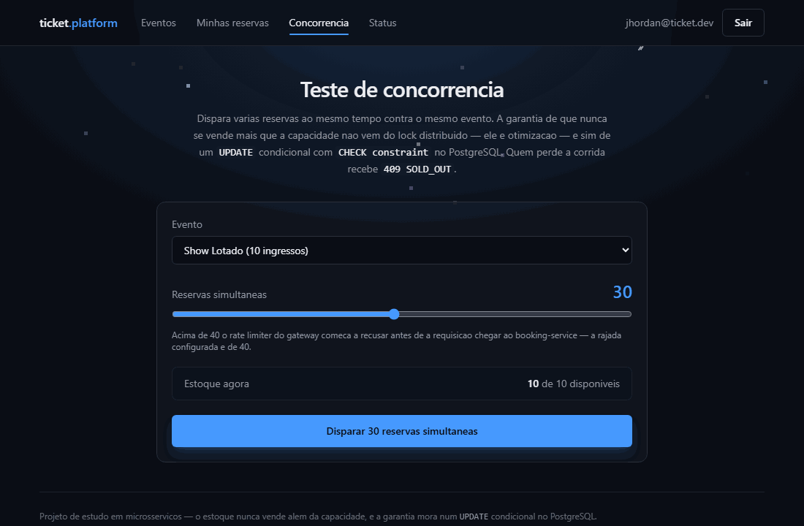
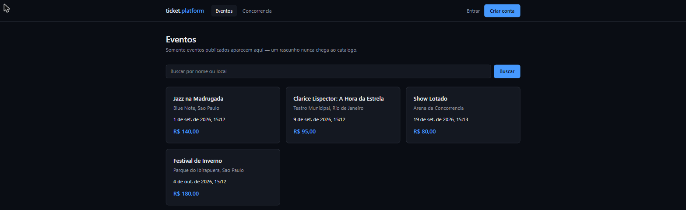
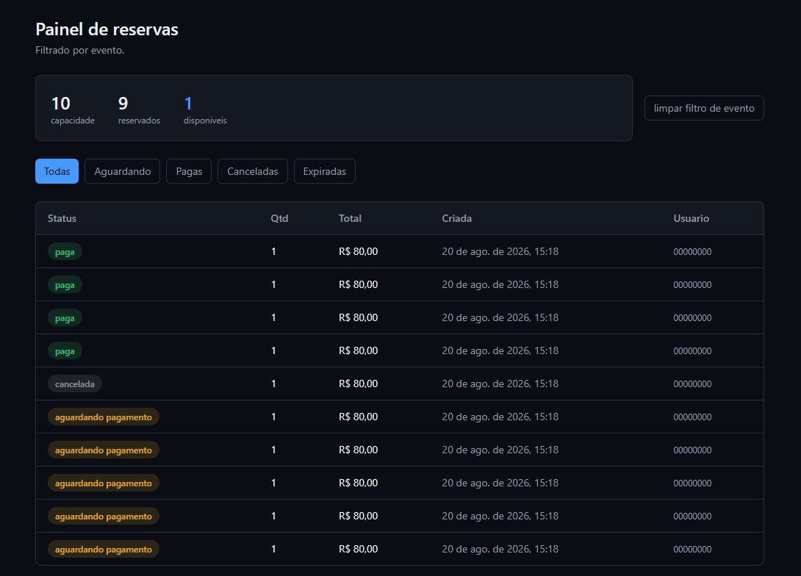
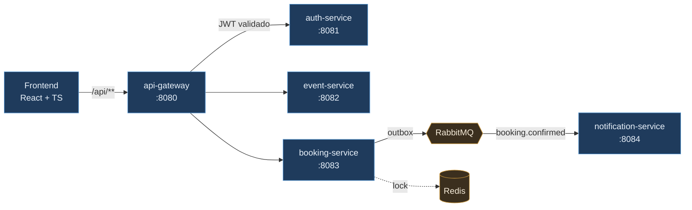
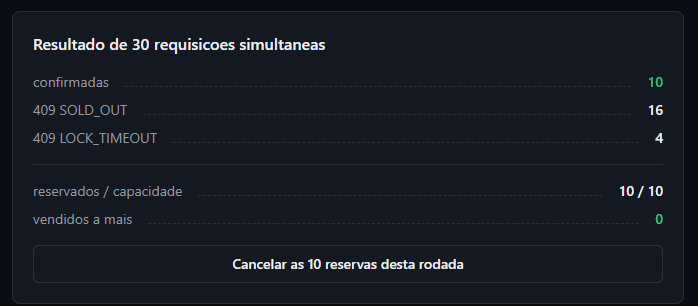

<div align="center">

# ticket.platform

**Venda de ingressos em microsserviços — e o problema de não vender o mesmo assento duas vezes.**

[](#)
[](#)
[](#)
[](#)
[](#)
[](#)
[](#)
[](#testes)

</div>

---

## O problema

Mil pessoas apertam "comprar" no mesmo segundo. Restam cinquenta ingressos.

Quantos você vende?

A resposta ingênua — consultar o estoque, decidir, gravar — **vende mais do que existe**. Entre a
consulta e a gravação há uma janela, e sob concorrência real alguém sempre entra nela. O resultado
aparece depois, no balcão do evento, quando duas pessoas têm o mesmo lugar.

Este projeto existe para resolver isso, mostrar **onde exatamente** a garantia mora, e provar que
ela funciona.

<div align="center">



<sub>30 reservas disparadas ao mesmo tempo contra um evento de 10 ingressos.<br/>
10 confirmadas, 20 recusadas, <b>zero vendidas a mais</b>.</sub>

</div>

---

## Rodando

```bash
git clone https://github.com/devBandeiraa/ticket-platform
cd ticket-platform
docker compose up --build
```

Nove containers sobem: PostgreSQL, Redis, RabbitMQ, cinco serviços e o frontend.

Depois disso → **http://localhost:5173** · admin: `admin@ticket.dev` / `admin@ticket.dev123`

Nenhum `.env` é necessário. Todo valor tem padrão.

Prefere ver em Kubernetes? Os manifestos estão em [`k8s/`](k8s/) — Kustomize, num cluster `kind`
descartável, com o `booking-service` em duas réplicas. O passo a passo está no
[`k8s/README.md`](k8s/README.md).

---

## Documentação da API

Com a plataforma no ar → **http://localhost:8080/swagger-ui.html**

Um Swagger UI só, no gateway, com um seletor para os três serviços que publicam HTTP. O gateway
não tem controller algum para documentar, mas é o único endereço que o consumidor conhece — é
onde a documentação precisa estar.

Cada serviço gera a própria especificação, e ela viaja pelas **mesmas rotas do tráfego normal**.
Isso é de propósito: se uma rota quebrar, a documentação correspondente quebra junto e o defeito
aparece — em vez de uma página saudável descrevendo um caminho que não responde mais.

O botão **Authorize** aceita o `accessToken` de `POST /auth/login`, e a partir daí o *Try it out*
funciona de ponta a ponta, passando pelo rate limiting e pela autenticação na borda como qualquer
chamada real.

Para fechar a documentação num ambiente público, `OPENAPI_ENABLED=false` — que remove os
endpoints, em vez de apenas protegê-los.

---

## Onde mora a garantia

**Não é no lock distribuído.** O lock existe, no Redis, e reduz contenção — mas é *otimização*.
Se ele expirar no meio da transação, ou se o Redis cair inteiro, a correção não se perde.

Ela mora no PostgreSQL, num `UPDATE` condicional protegido por uma `CHECK constraint`:

```java
@Modifying(clearAutomatically = true, flushAutomatically = true)
@Query("""
        UPDATE EventInventory estoque
           SET estoque.reservedTickets = estoque.reservedTickets + :quantidade
         WHERE estoque.eventId = :eventId
           AND estoque.reservedTickets + :quantidade <= estoque.totalTickets
        """)
int reservar(@Param("eventId") UUID eventId, @Param("quantidade") int quantidade);
```

```sql
CONSTRAINT ck_event_inventory_reserved
    CHECK (reserved_tickets >= 0 AND reserved_tickets <= total_tickets)
```

Zero linhas afetadas significa que os ingressos acabaram entre a consulta e a escrita — e o
serviço responde `409 SOLD_OUT`. **Não há janela entre verificar e gravar, porque as duas coisas
são a mesma operação.** A constraint é a rede embaixo: mesmo que alguém escreva outro caminho de
escrita amanhã, o banco recusa.

É esse desenho que a tela acima exercita, e que um teste de 200 threads verifica a cada build.

---

## O bug que o teste pegou

> **Este projeto já vendeu 70 ingressos para um evento de 50.**

O teste de concorrência acusou na primeira execução. A causa não estava no lock nem no SQL —
estava numa sutileza do Spring Data.

`EventInventory` usa o `event_id` como chave primária, um id **atribuído**, e não gerado. Para o
Spring Data, uma entidade com id preenchido "já existe", então `save()` executava `merge` em vez
de `persist`. Sob concorrência, uma requisição que carregava o estoque logo depois de outra já ter
inserido gravava um `UPDATE` que **zerava `reserved_tickets`**, apagando reservas já contabilizadas.

A correção foi implementar `Persistable<UUID>`, forçando `persist` — e, com ele, uma violação de
chave primária honesta em vez de uma sobrescrita silenciosa.

Fica registrado aqui de propósito. O ponto do projeto não é ter acertado de primeira: é ter um
teste que **não deixa passar**.

---

## As telas

<table>
<tr>
<td width="50%" valign="top">

**Catálogo público**



Só eventos publicados aparecem. Um rascunho nunca chega aqui — publicar é um ato deliberado, e
não efeito colateral de salvar.

</td>
<td width="50%" valign="top">

**Painel de reservas**



Capacidade, reservados e disponíveis em tempo real. Note os `9 / 1`: uma reserva foi cancelada e
o ingresso **voltou ao estoque**.

</td>
</tr>
</table>

---

## Além do overselling

| Problema | Solução | Por quê |
|---|---|---|
| Reserva confirma, mas o `publish` no RabbitMQ falha | **Transactional outbox** | O evento é gravado na mesma transação que confirma a reserva. Publicar direto deixaria a reserva `CONFIRMED` sem ninguém ser avisado, em silêncio |
| Cliente clica duas vezes | **`Idempotency-Key`** com unique constraint | Única por usuário, não global: chave global deixaria reaproveitar a de outro e receber a reserva alheia |
| A outbox entrega *ao menos uma vez* | **Dedup por `message-id`** no Redis | Fecha do lado do consumidor a janela que o produtor não fecha sem commit distribuído |
| Redis cai | **Degrada para "só banco"** | A reserva segue, sem lock, correta pelo `UPDATE` condicional. Recusar faria do cache um ponto único de falha da operação mais importante |
| Mensagem defeituosa em laço | **DLQ após 3 tentativas** | Payload malformado vai direto, sem retentar: retentar não conserta JSON quebrado |
| Cliente forja `X-User-Role: ADMIN` | **Gateway apaga e reescreve** | O cabeçalho de identidade não se aceita, se afirma |
| Força bruta de senha | **Rate limit em dois baldes** | Login por IP (quem ataca não tem token); o resto por usuário, para não punir quem divide o NAT |

---

## Arquitetura



<sub>Cada serviço tem o seu banco — omitidos aqui para o desenho mostrar o caminho da requisição.
A tabela abaixo lista todos.</sub>

| Serviço | Porta | Banco | Papel |
|---|---|---|---|
| `api-gateway` | 8080 | — | Roteamento, autenticação na borda, rate limiting |
| `auth-service` | 8081 | `authdb` | Cadastro, login, emissão de JWT |
| `event-service` | 8082 | `eventdb` | Catálogo e gestão de eventos |
| `booking-service` | 8083 | `bookingdb` | Reserva com lock distribuído — **núcleo do projeto** |
| `notification-service` | 8084 | — | Consumidor de fila, notificação assíncrona |
| `frontend` | 5173 | — | Interface; consome só o gateway |

**Database per service**, de verdade: cada banco tem usuário próprio e nenhum serviço alcança a
tabela do outro. O `notification-service` **não tem banco** — não há estado a persistir, e
inventar um seria complexidade sem função.

`shared-security` é biblioteca, não serviço: validação de JWT e formato de erro, compartilhados
sem que nenhum serviço dependa de outro em tempo de execução.

Há **uma única chamada síncrona entre serviços**: o `booking-service` consulta o `event-service`
por REST na primeira reserva de cada evento, para copiar capacidade e preço. Depois disso o
contador de estoque é local — e é isso que permite decidir a reserva com uma transação só, sem
commit distribuído.

---

## Onde olhar no código

| Pergunta | Arquivo |
|---|---|
| Como o overselling é impedido? | [`EventInventoryRepository.java`](booking-service/src/main/java/com/devbandeiraa/bookingservice/repository/EventInventoryRepository.java) · [`V1__cria_tabelas_de_reserva.sql`](booking-service/src/main/resources/db/migration/V1__cria_tabelas_de_reserva.sql) |
| E o lock distribuído? | [`RedisDistributedLock.java`](booking-service/src/main/java/com/devbandeiraa/bookingservice/lock/RedisDistributedLock.java) |
| Como a reserva é orquestrada? | [`BookingService.java`](booking-service/src/main/java/com/devbandeiraa/bookingservice/service/BookingService.java) |
| Como o evento não se perde? | [`OutboxPublisher.java`](booking-service/src/main/java/com/devbandeiraa/bookingservice/messaging/OutboxPublisher.java) |
| Como duplicatas são descartadas? | [`BookingConfirmedListener.java`](notification-service/src/main/java/com/devbandeiraa/notificationservice/messaging/BookingConfirmedListener.java) |
| Como o gateway autentica? | [`AutenticacaoNaBordaFilter.java`](api-gateway/src/main/java/com/devbandeiraa/apigateway/security/AutenticacaoNaBordaFilter.java) |
| Onde as rotas são declaradas? | [`application.yml`](api-gateway/src/main/resources/application.yml) |
| Como a documentação é agregada? | [`application.yml`](api-gateway/src/main/resources/application.yml) *(bloco `springdoc`)* · [`OpenApiConfig.java`](booking-service/src/main/java/com/devbandeiraa/bookingservice/config/OpenApiConfig.java) |
| A prova de que funciona | [`OversellingConcorrenteIntegrationTest.java`](booking-service/src/test/java/com/devbandeiraa/bookingservice/integration/OversellingConcorrenteIntegrationTest.java) |

---

## Testes

**217 no total** — 199 no backend, com PostgreSQL, Redis e RabbitMQ **reais** via Testcontainers,
e 18 no frontend. Nada de H2: o isolamento transacional do PostgreSQL é o objeto do teste, e um
banco em memória não o reproduz.

| Teste | O que prova |
|---|---|
| `OversellingConcorrenteIntegrationTest` | 200 threads, 50 ingressos, exatamente 50 vendidos |
| `OversellingSemLockIntegrationTest` | O mesmo **com o lock desligado** — a garantia é do banco |
| `OutboxIntegrationTest` | O evento sobrevive à falha do publicador |
| `ConsumoDeConfirmacaoIntegrationTest` | Duplicata descartada, retry vence falha transitória, DLQ recebe a permanente |
| `RateLimitIntegrationTest` | Os dois baldes são independentes, e o `429` sai no formato de erro da API |
| `cliente.test.ts` | Renovação de token compartilhada entre chamadas simultâneas |
| `DocumentacaoOpenApiIntegrationTest` | A especificação não mente sobre o que é público — e o `409 SOLD_OUT` continua documentado |
| `DocumentacaoAgregadaIntegrationTest` | O Swagger do gateway sobe e aponta para rotas que existem — dois bugs reais, ambos com build verde e página 404 |
| `OutboxIntegrationTest` *(broker inalcançável)* | Broker fora do ar não consome o orçamento de tentativas — bug encontrado ao subir em Kubernetes |

```bash
./mvnw clean install          # backend — exige Docker, para os Testcontainers
cd frontend && npm test       # frontend
```

<div align="center">



</div>

---

## Limitações conscientes

Escolhas de escopo, não descuidos. Todas estão registradas com justificativa em
[`docs/00-mapeamento.md`](docs/00-mapeamento.md).

- **HS256 com segredo compartilhado.** Quem valida o token também consegue emitir. Em produção
  viraria RS256 com JWKS — o gateway validaria com a chave pública sem poder assinar nada.
- **Pagamento simulado.** O ciclo `PENDING → CONFIRMED → EXPIRED` é real, incluindo a devolução de
  estoque; o que não existe é o gateway de pagamento.
- **Uma instância de cada banco.** Sem réplica de leitura, sem particionamento.
- **Sem tracing distribuído.** Há `traceId` por resposta e métricas via Micrometer, mas não um
  Jaeger ligando os saltos.
- **Sem CI.** Os testes rodam localmente; um workflow de GitHub Actions é o próximo passo natural.
- **Kubernetes só em cluster local.** Um nó, `NodePort` em vez de Ingress, sem HPA e com os
  Secrets versionados para o projeto subir com um comando. As três coisas mudam em ambiente real,
  e o [`k8s/README.md`](k8s/README.md) diz como.

---

## Rodando sem containers

Para depurar um serviço pela IDE, suba só a infraestrutura:

```bash
docker compose up postgres redis rabbitmq
./mvnw clean install

SPRING_PROFILES_ACTIVE=dev java -jar auth-service/target/auth-service-0.0.1-SNAPSHOT.jar
java -jar event-service/target/event-service-0.0.1-SNAPSHOT.jar
java -jar booking-service/target/booking-service-0.0.1-SNAPSHOT.jar
java -jar notification-service/target/notification-service-0.0.1-SNAPSHOT.jar
java -jar api-gateway/target/api-gateway-0.0.1-SNAPSHOT.jar

cd frontend && npm run dev
```

O profile `dev` aplica o seed do primeiro administrador. Sem ele o banco nasce sem admin, e não há
caminho para criar o primeiro evento — o cadastro público sempre gera `USER`.

---

## Documentação

[**`docs/00-mapeamento.md`**](docs/00-mapeamento.md) — escrito **antes** da primeira linha de
código de negócio, e atualizado a cada fase:

- Modelo de dados, tabela por tabela, com a razão de cada constraint
- Contratos de API e a tabela de rotas do gateway
- O fluxo da reserva passo a passo, do clique ao commit
- **32 riscos técnicos**, cada um com o que se fez a respeito
- **Tabela de decisões** — cada escolha com a justificativa e a alternativa recusada

O projeto foi construído em nove fases, uma por Pull Request, cada uma com o seu checkpoint.
O [histórico de PRs](https://github.com/devBandeiraa/ticket-platform/pulls?q=is%3Apr+is%3Aclosed)
mostra o raciocínio de cada etapa.

---

<div align="center">
<sub>

Feito por [**@devBandeiraa**](https://github.com/devBandeiraa)

</sub>
</div>
